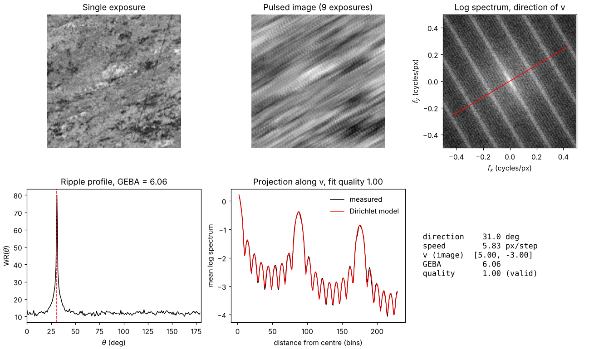
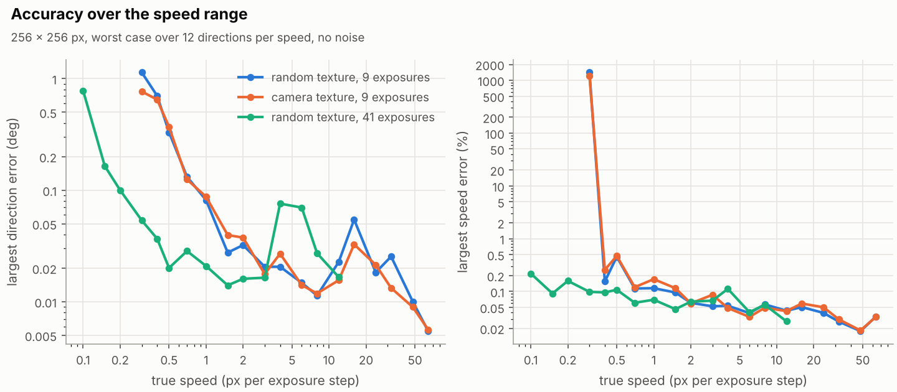
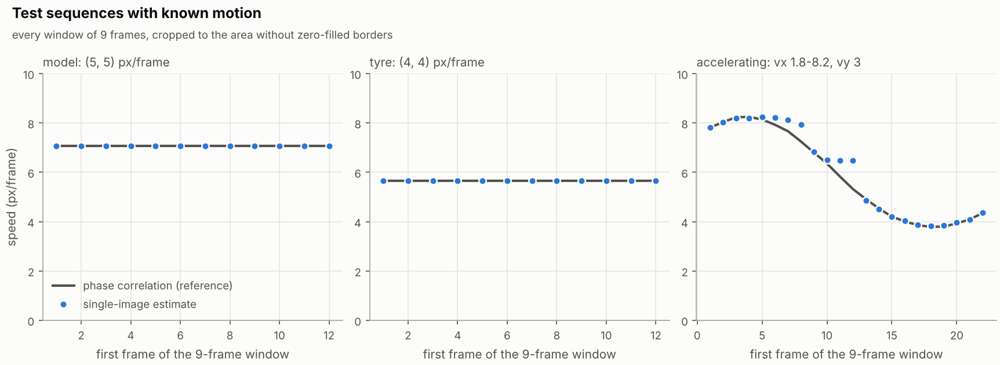
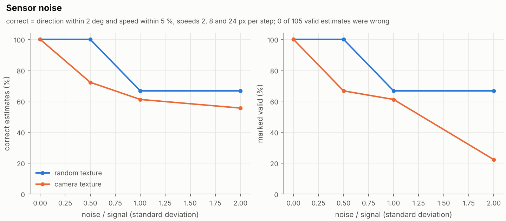
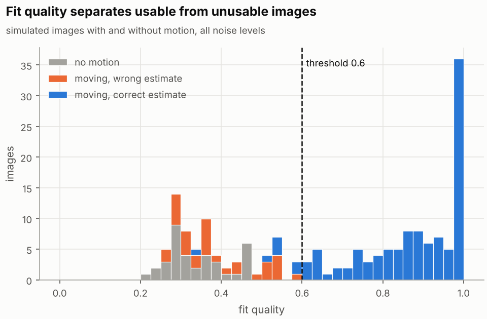
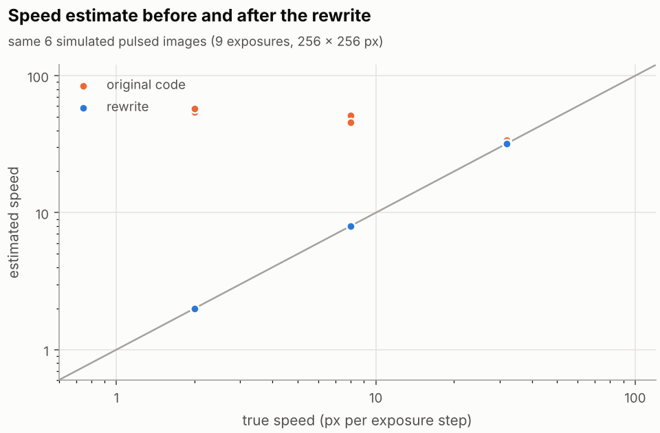
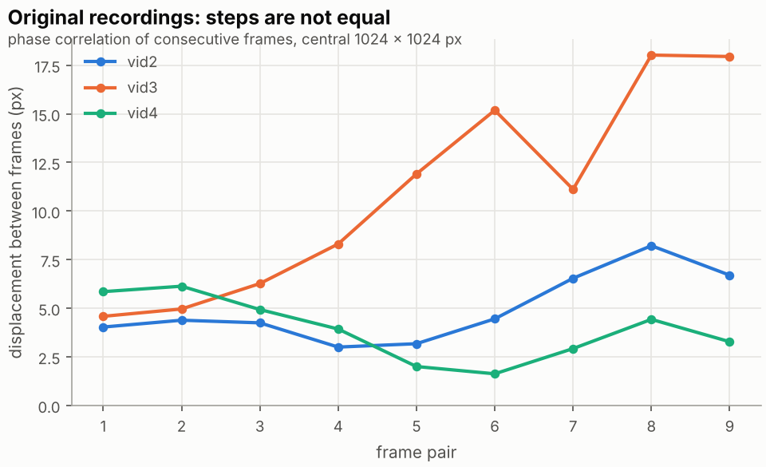

# 2D-FFT velocity estimation from a single image

[](https://github.com/onewmann/2D-FFT-Code/actions/workflows/ci.yml)

Estimates direction and speed of a moving surface from one image. The camera
integrates several short exposures (pulses) into one frame while the surface
moves. That motion leaves a pattern of straight lines in the image spectrum:
their orientation gives the direction, their spacing the speed. A Radon
transform of the log spectrum finds both.

The same algorithm runs in MATLAB, GNU Octave and Python and gives identical
results (differences below 1e-9). The MATLAB/Octave code needs no toolbox.



*Simulated pulsed image of a real surface (recorded with a Basler camera), moving
by (5, -3) px per exposure. Estimate: 30.97 deg and 5.83 px per step, true
values 30.96 deg and 5.83 px.*

## How it works

A pulsed-exposure image is the mean of $2L+1$ exposures of a texture $b$ that
moves by $\mathbf v$ between two exposures:

$$b_p(\mathbf x) = \frac{1}{2L+1}\sum_{k=-L}^{L} b(\mathbf x - k\mathbf v)
\quad\Longrightarrow\quad
B_p(\mathbf f) = B(\mathbf f)\,D(\mathbf f\cdot\mathbf v),\qquad
D(u) = \frac{\sin\big((2L+1)\pi u\big)}{(2L+1)\sin(\pi u)}$$

The Dirichlet kernel $D$ is 1 wherever $\mathbf f\cdot\mathbf v$ is an integer,
so the spectrum carries lines perpendicular to $\mathbf v$, spaced $1/|\mathbf v|$
cycles per pixel apart, with $2L-1$ weaker side lobes in between.

1. **Spectrum.** Remove the mean, apply a 2-D Hann window, zero-pad the FFT to
   twice the image size and take $\log(|B_p| + 0.05\,\mathrm{median}|B_p|)$.
2. **Direction.** Average the log spectrum along parallel lines for every angle
   $\theta$ (a Radon transform that uses the mean instead of the sum, so the
   square support does not favour the diagonals). Only the projection along
   $\mathbf v$ turns the lines into a sharp comb, so the ripple profile
   $WR(\theta) = \sum_r |\partial_r R(r,\theta)|$ peaks at the direction of
   motion. GEBA $= \max WR / \mathrm{mean}\, WR$ measures how clearly it does.
3. **Speed.** Compare the projection along that direction with the expected
   profile for $2L+1$ exposures on a grid of speeds. For a random texture the
   expected power at bin $j$ is

   $$P(j) = \frac{1}{(2L+1)^2}\Big[(2L+1) + 2\sum_{m=1}^{2L}(2L+1-m)\,
   \rho(m\mathbf v)\cos\Big(\frac{2\pi j m |\mathbf v|}{N_\mathrm{pad}}\Big)\Big]$$

   where $\rho(m\mathbf v)$ is the autocorrelation of the window at the offset
   between two exposures $m$ steps apart. This closed form includes the blur
   caused by the window and cannot alias. A cubic polynomial absorbs the smooth
   spectrum of the texture; the speed with the highest correlation wins, and
   that correlation is the fit quality.
4. **Validity.** An estimate counts as valid if the fit quality is at least 0.6.
   Images without motion, with too much noise or with uneven exposure steps stay
   below that.

Directions are given in degrees, counter-clockwise from the x axis as seen on
screen, in [0, 180). One image cannot tell $\mathbf v$ from $-\mathbf v$.

## Results

All numbers come from `benchmark/run_benchmark.py`; the CSV files are in
`benchmark/results/`.

**Accuracy.** For 256 x 256 px and 9 exposures the direction is within
0.7 deg and the speed within 0.5 % from 0.4 to 64 px per step (within 0.1 deg
above 1 px per step). With 41 exposures the range starts at 0.1 px per step.
A real surface texture gives the same accuracy as a random one.



**Ground truth.** On the test sequences of the original project, which move by
exactly (5, 5) and (4, 4) px per frame, every 9-frame window gives 135.0 deg
and a speed within 0.004 px per frame. When the speed changes inside the window
(right panel) the estimate stays within 1.2 px per frame of the mean motion.



**Noise.** With white noise of half the signal's standard deviation, 86 % of
the estimates are correct (direction within 2 deg, speed within 5 %); with
noise as strong as the signal, 64 %. The fit quality catches the failures: no
estimate marked valid was wrong, and none of 36 images without motion was
marked valid.




**Before and after.** On the same simulated images the speed estimate of the
original code is off by 509 % (median), the rewrite by 0.015 %. The original
code found the direction but took its speed from noise peaks.



## Quick start

### Python

```bash
pip install -e "python[plot]"
python -m fftvel simulate --vx 5 --vy -3 --plot estimate.png
python -m fftvel estimate my_pulsed_image.png --L 4
```

```python
from fftvel import estimate_velocity, simulate_pulsed_image

bp = simulate_pulsed_image(256, v=(5, -3), L=4)    # or the mean of 9 camera frames
est = estimate_velocity(bp, L=4)
print(est.angle_deg, est.speed, est.quality, est.valid)
```

### MATLAB or GNU Octave

```matlab
addpath('matlab')
bp  = simulate_pulsed_image(256, [5 -3], 4);       % or mean(double(frames), 3)
est = estimate_velocity(bp, 'L', 4, 'Diagnostics', true);
plot_estimate(bp, est)
```

`matlab/examples/demo_simulation.m` and `demo_testsequences.m` run unchanged in
both. Octave needs about 2 s for a 256 x 256 image, Python about 0.5 s.

### Live camera

* MATLAB: `matlab/examples/live_basler.m` streams from a Basler camera through
  the Image Acquisition Toolbox (GenTL), averages 2L+1 consecutive frames and
  reports direction and speed in px per frame and px per second.
* Python: `python/examples/live_camera.py --source pylon` does the same with
  [pypylon](https://github.com/basler/pypylon); `--source 0` uses any webcam
  and `--source video.mp4` a recording.

Both use the camera timestamps and skip windows whose frame intervals differ
by more than 20 %, because the model needs equal steps. Neither has been run
on camera hardware as part of this repository's tests.

## Repository layout

```
matlab/            estimator, simulation and plotting (MATLAB and Octave, no toolboxes)
matlab/examples/   demos and the live Basler GUI
python/            the same as the Python package fftvel, plus examples
tests/             test suites for both languages and shared parity cases
benchmark/         accuracy, noise and before/after study, the original estimator for comparison
data/              test sequences with known motion and a real surface texture
docs/figures/      figures of this README
```

## Tests

```bash
octave --no-gui --eval "cd tests/matlab; run_tests"     # or: matlab -batch "cd tests/matlab; run_tests"
python -m pytest tests/python
```

The suites check the angle convention, known motion in simulations and on the
test sequences, rejection of static scenes, input handling, and parity: the
same eight input images (including odd sizes, a non-square image and other
FFT lengths) must give the same result in both languages. GitHub Actions runs
the Python suite and the MATLAB suite in GNU Octave on every push.

## Background

This started as my student project at Hochschule Esslingen (2025). The method
follows Chapter 3 of [REFERENCE: dissertation, to be added]. The original
MATLAB scripts are archived in
[onewmann/hs-esslingen](https://github.com/onewmann/hs-esslingen/tree/main/2D-FFT).

A review of those scripts found the speed estimate was wrong in every script
that computed it, mainly because peaks were picked with a fixed threshold that
let noise through. Live frames were also resized to 256 x 256 px with different
scale factors per axis, which distorted both direction and speed. In addition,
the recorded videos do not have equal steps between frames, which the method
needs:



The rewrite keeps the idea (log spectrum, Radon transform, ripple profile and
GEBA) and changes the rest:

* the speed comes from a fit of the Dirichlet model instead of peak counting,
  and the fit quality decides whether a result is valid;
* images are cropped to a square, never resized, so the speed stays in camera
  pixels;
* the Radon step averages instead of summing, which removes the bias towards
  45 and 135 deg;
* simulations move a fixed window over a larger texture instead of shifting
  with zero-filled borders, which better matches a camera;
* one implementation per language instead of about 40 script versions, with
  tests that run in CI.

## Limitations

* The surface needs texture, and the motion has to be constant during the
  2L+1 exposures, which must be equally spaced in time. L has to be known.
* The measurable range depends on the image size N and on L. The lower end is
  about $3.3/(2L+1)$ px per step (0.4 for L = 4, 0.08 for L = 20), where the
  first zero of the Dirichlet kernel still lies inside the spectrum. The
  benchmark covers speeds up to N/4 (64 px per step for N = 256).
* Direction is only known modulo 180 deg.
* The MATLAB code is written for base MATLAB and tested in GNU Octave 8; it has
  not been run in MATLAB itself as part of the CI.

## License

MIT, see [LICENSE](LICENSE). Oliver Neumann.
